# Compte-Rendu : img/Implémentation du TD1 avec Doctrine ORM

Ce document retrace l'intégralité de la démarche, de l'analyse du squelette initial jusqu'à l'obtention d'un projet complet et fonctionnel.

## 1. Contexte du Projet
Le projet consiste à img/implémenter la gestion de données de Bases de Données en utilisant **Doctrine ORM 3**. Le squelette de départ incluait la structure Docker, les fichiers SQL et une configuration de base.

---

## 2. Étapes de Réalisation

### A. Analyse Initiale du Squelette
- **composer.json** : Identification des dépendances (Doctrine 3.3, Ramsey UUID, Faker) et de la configuration PSR-4 initiale.
- **docker-compose.yml** : Analyse des services `prati.app` (PHP) et `praticien.db` (Postgres).
- **SQL** : Étude du schéma (`prati.schema.sql`) et des données (`prati.data.sql`) pour comprendre les relations (Praticien, Spécialité, Structure, etc.).

### B. img/Implémentation des Entités et Repositories
1. **Entités** : Création des classes `Praticien`, `Specialite`, `Structure`, `MotifVisite`, `MoyenPaiement` avec leurs attributs de mapping.
2. **Relations** : Configuration des relations `ManyToOne` et `ManyToMany` (ex : Praticien rattaché à une Structure et une Spécialité, acceptant plusieurs moyens de paiement).
3. **Repositories** : img/Implémentation de requêtes DQL spécialisées :
   - `findByKeyword` dans `SpecialiteRepository`.
   - `findBySpecialiteKeyword` et `findBySpecialiteAndMoyenPaiement` dans `PraticienRepository`.

### C. Exercices :

#### **Exercice 1 : Manipulation de base**
- **Mapping des relations** via configuration des relations `ManyToOne` (Praticien -> Specialite, Praticien -> Structure) et `ManyToMany` (Praticien -> MoyenPaiement).
- img/Implémentation de la création, modification et suppression d'un praticien via l'EntityManager.

#### **Exercice 2 : Requêtes avec Criteria et Repositories**
- Utilisation de l'API **Criteria** de Doctrine pour effectuer des filtres complexes sans DQL (ex: recherche par description).
- Utilisation des méthodes magiques de recherche (`findOneBy`, `findBy`).

#### **Exercice 3 : DQL personnalisé**
- img/Implémentation de méthodes de recherche spécialisées dans `PraticienRepository` et `SpecialiteRepository` en utilisant le langage **DQL** :
  - `findByKeyword` (Specialite)
  - `findBySpecialiteKeyword` (Praticien)
  - `findBySpecialiteAndMoyenPaiement` (Jointures complexes)


## 3. Autres problèmes rencontrés liés à Doctrine et Solutions

- **Doctrine 3 API Change** : La méthode statique `create()` a été remplacée par l'instanciation manuelle de l'EntityManager.
- **Erreur de Type UUID** : Installation de `ramsey/uuid-doctrine` et enregistrement manuel du type dans Doctrine.
- **Erreur de "Valid binary" (Postgres)** : Les colonnes `bit(1)` posaient problème notamment pour les colonnes `organisation` et `nouveau_patient`. La solution a été le mapping via `registerDoctrineTypeMapping('bit', 'string')` dans le bootstrap.

---

## 4. Commandes du projet

Voici les commandes principales utilisées pour mettre en place et gérer l'environnement :
### Environnement
- **Création du fichier d'environnement .env** :
`cp prat.env.dist prat.env`

### Docker Compose
- **Démarrer l'environnement** : `docker-compose up -d`
- **Arrêter l'environnement** : `docker-compose down`
- **Voir les logs** : `docker-compose logs -f`

### Composer (Gestion des dépendances)
- **Installation du bridge UUID** : `docker-compose exec prati.app composer require ramsey/uuid-doctrine`
- **Mise à jour de l'autoload (après refactorisation)** : `docker-compose exec prati.app composer dump-autoload`

### SQL (Initialisation de la base de données si problèmes de volumes)
- **img/Import du schéma** :
  ```bash
  docker-compose exec -T praticien.db psql -U prati -d prati -f /var/sql/prati.schema.sql
  ```
- **img/Import des données** :
  ```bash
  docker-compose exec -T praticien.db psql -U prati -d prati -f /var/sql/prati.data.sql
  ```

---

## 5. Accès et Exécution

### En Ligne de Commande
```bash
docker-compose exec prati.app php public/td1.php
```

### Via le Navigateur (Web)
Le serveur web est configuré sur le port **3080** :
- [http://localhost:3080](http://localhost:3080) (Redirige vers `td1.php`).
- L'administration (Adminer) est disponible sur le port **8085**.

Rendu global (**compact**) : 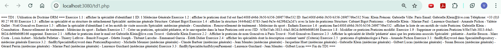

### Détail des Exercices et Résultats

J'ai réalisé les exercices du TD1 et affiché les résultats en ligne de commande et via le navigateur.

#### **Exercice 1 : Manipulation de base**

**Requête 1.1 : Afficher la spécialité d'identifiant 1**
- **Objectif** : Vérifier le mapping de base et la récupération d'une entité par son ID.
- **Résultat** : 
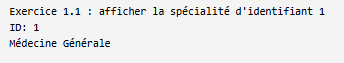

**Requête 1.2 : Afficher le praticien par ID UUID**
- **Objectif** : Tester la gestion des UUID (ramsey/uuid-doctrine).
- **Résultat** : 
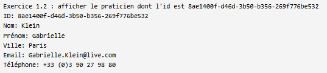

**Requête 1.3 : Afficher spécialité et structure de rattachement**
- **Objectif** : Vérifier les relations `ManyToOne`.
- **Résultat** : 
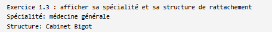

**Requête 1.4 : Afficher une structure avec sa liste de praticiens**
- **Objectif** : Vérifier les relations `OneToMany` (bidirectionnelles).
- **Résultat** : 
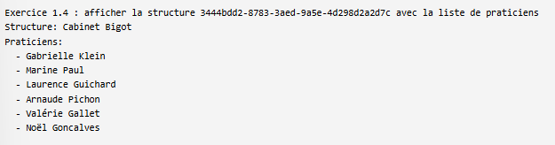

**Requête 1.5 : Afficher une spécialité et ses motifs de visite**
- **Objectif** : Vérifier les relations entre Spécialité et MotifVisite.
- **Résultat** : 
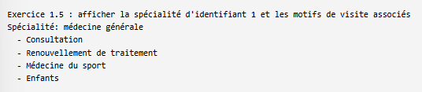

**Requête 1.6 : Afficher les motifs de visite d'un praticien**
- **Objectif** : Vérifier les relations entre Praticien et MotifVisite.
- **Résultat** : 
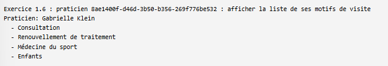

**Requête 1.7 à 1.9 : Persistance (CRUD)**
- **Objectif** : Créer, modifier et supprimg/imer un praticien via l'EntityManager.
- **Résultat** : 

---

#### **Exercice 2 : Requêtes avec Criteria et Repositories**

**Requête 2.1 : Chercher un praticien par email**
- **Objectif** : Utiliser `findOneBy` avec un attribut unique.
- **Résultat** : 
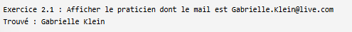

**Requête 2.2 : Chercher par nom et ville**
- **Objectif** : Utiliser `findOneBy` avec plusieurs critères.
- **Résultat** : 
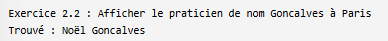

**Requête 2.3 : Chercher spécialité par libellé et praticiens associés**
- **Objectif** : Vérifier le filtrage sur une entité liée.
- **Résultat** : 
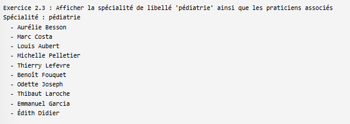

**Requête 2.4 : Filtrer les spécialités par mot-clé (Criteria)**
- **Objectif** : Utiliser l'API **Criteria** pour filtrer sur la description.
- **Résultat** : 
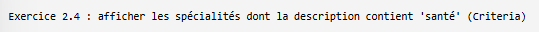

**Requête 2.5 : Praticiens d'ophtalmologie à Paris**
- **Objectif** : Combiner plusieurs filtres complexes.
- **Résultat** : 
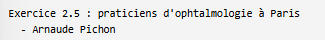

---

#### **Exercice 3 : DQL personnalisé**

**Requête 3.1 : Recherche par mot-clé (SpecialiteRepository)**
- **Objectif** : Implémenter une méthode DQL personnalisée `findByKeyword`.
- **Résultat** : 


**Requête 3.2 : Recherche de praticiens par mot-clé de spécialité**
- **Objectif** : Utiliser une jointure DQL.
- **Résultat** : 


**Requête 3.3 : Recherche complexe (Spécialité + Moyen de Paiement)**
- **Objectif** : Jointure multiple en DQL (Praticien, Spécialité, MoyenPaiement).
- **Résultat** : 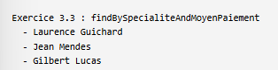


## Conclusion
  Ce TP a permis de maîtriser les fondamentaux de Doctrine 3, notamment la séparation des responsabilités via les Repositories et la gestion de types de données complexes (UUID, bit) sous PostgreSQL. L'utilisation conjointe du DQL et de l'API Criteria illustre la puissance d'un ORM pour manipuler les données de manière typée et évolutive.
