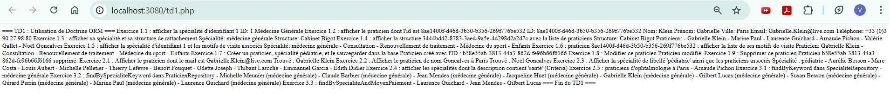

# Compte-Rendu : Implémentation du TD1 avec Doctrine ORM

Ce document retrace l'intégralité de la démarche, de l'analyse du squelette initial jusqu'à l'obtention d'un projet complet et fonctionnel.

## 1. Contexte du Projet
Le projet consiste à implémenter la gestion de données de Bases de Données en utilisant **Doctrine ORM 3**. Le squelette de départ incluait la structure Docker, les fichiers SQL et une configuration de base.

---

## 2. Étapes de Réalisation

### A. Analyse Initiale du Squelette
- **composer.json** : Identification des dépendances (Doctrine 3.3, Ramsey UUID, Faker) et de la configuration PSR-4 initiale.
- **docker-compose.yml** : Analyse des services `prati.app` (PHP) et `praticien.db` (Postgres).
- **SQL** : Étude du schéma (`prati.schema.sql`) et des données (`prati.data.sql`) pour comprendre les relations (Praticien, Spécialité, Structure, etc.).

### B. Implémentation des Entités et Repositories
1. **Entités** : Création des classes `Praticien`, `Specialite`, `Structure`, `MotifVisite`, `MoyenPaiement` avec leurs attributs de mapping.
2. **Relations** : Configuration des relations `ManyToOne` et `ManyToMany` (ex : Praticien rattaché à une Structure et une Spécialité, acceptant plusieurs moyens de paiement).
3. **Repositories** : Implémentation de requêtes DQL spécialisées :
   - `findByKeyword` dans `SpecialiteRepository`.
   - `findBySpecialiteKeyword` et `findBySpecialiteAndMoyenPaiement` dans `PraticienRepository`.

### C. Exercices :

#### **Exercice 1 : Manipulation de base**
- **Mapping des relations** via configuration des relations `ManyToOne` (Praticien -> Specialite, Praticien -> Structure) et `ManyToMany` (Praticien -> MoyenPaiement).
- Implémentation de la création, modification et suppression d'un praticien via l'EntityManager.

#### **Exercice 2 : Requêtes avec Criteria et Repositories**
- Utilisation de l'API **Criteria** de Doctrine pour effectuer des filtres complexes sans DQL (ex: recherche par description).
- Utilisation des méthodes magiques de recherche (`findOneBy`, `findBy`).

#### **Exercice 3 : DQL personnalisé**
- Implémentation de méthodes de recherche spécialisées dans `PraticienRepository` et `SpecialiteRepository` en utilisant le langage **DQL** :
  - `findByKeyword` (Specialite)
  - `findBySpecialiteKeyword` (Praticien)
  - `findBySpecialiteAndMoyenPaiement` (Jointures complexes)


## 3. Autres problèmes rencontrés liés à Doctrine et Solutions

| Problème | Solution |
| :--- | :--- |
| **Doctrine 3 API Change** | La méthode statique `create()` a été remplacée par l'instanciation manuelle de l'EntityManager. |
| **Erreur de Type UUID** | Installation de `ramsey/uuid-doctrine` et enregistrement manuel du type dans Doctrine. |
| **Erreur de "Valid binary" (Postgres)** | Les colonnes `bit(1)` posaient problème notamment pour les colonnes `organisation` et `nouveau_patient`. La solution a été le mapping via `registerDoctrineTypeMapping('bit', 'string')` dans le bootstrap. |

---

## 4. Commandes du projet

Voici les commandes principales utilisées pour mettre en place et gérer l'environnement :
### Environnement
- **Création du fichier d'environnement .env** :
`cp prat.env.dist prat.env`

### Docker Compose
- **Démarrer l'environnement** : `docker-compose up -d`
- **Arrêter l'environnement** : `docker-compose down`
- **Voir les logs** : `docker-compose logs -f`

### Composer (Gestion des dépendances)
- **Installation du bridge UUID** : `docker-compose exec prati.app composer require ramsey/uuid-doctrine`
- **Mise à jour de l'autoload (après refactorisation)** : `docker-compose exec prati.app composer dump-autoload`

### SQL (Initialisation de la base de données si problèmes de volumes)
- **Import du schéma** :
  ```bash
  docker-compose exec -T praticien.db psql -U prati -d prati -f /var/sql/prati.schema.sql
  ```
- **Import des données** :
  ```bash
  docker-compose exec -T praticien.db psql -U prati -d prati -f /var/sql/prati.data.sql
  ```

---

## 5. Accès et Exécution

### En Ligne de Commande
```bash
docker-compose exec prati.app php public/td1.php
```

### Via le Navigateur (Web)
Le serveur web est configuré sur le port **3080** :
- [http://localhost:3080](http://localhost:3080) (Redirige vers `td1.php`).
- L'administration (Adminer) est disponible sur le port **8085**.

Rendu sur Navigateur : 
Rendu par ligne de commande : 
```
=== TD1 : Utilisation de Doctrine ORM ===

Exercice 1.1 : afficher la spécialité d'identifiant 1
ID: 1
Médecine Générale

Exercice 1.2 : afficher le praticien dont l'id est 8ae1400f-d46d-3b50-b356-269f776be532
ID: 8ae1400f-d46d-3b50-b356-269f776be532
Nom: Klein
Prénom: Gabrielle
Ville: Paris
Email: Gabrielle.Klein@live.com
Téléphone: +33 (0)3 90 27 98 80

Exercice 1.3 : afficher sa spécialité et sa structure de rattachement
Spécialité: médecine générale
Structure: Cabinet Bigot

Exercice 1.4 : afficher la structure 3444bdd2-8783-3aed-9a5e-4d298d2a2d7c avec la liste de praticiens
Structure: Cabinet Bigot
Praticiens:
  - Gabrielle Klein
  - Valérie Gallet
  - Noël Goncalves
  - Marine Paul
  - Laurence Guichard
  - Arnaude Pichon

Exercice 1.5 : afficher la spécialité d'identifiant 1 et les motifs de visite associés
Spécialité: médecine générale
  - Consultation
  - Renouvellement de traitement
  - Médecine du sport
  - Enfants

Exercice 1.6 : praticien 8ae1400f-d46d-3b50-b356-269f776be532 : afficher la liste de ses motifs de visite    
Praticien: Gabrielle Klein
  - Consultation
  - Renouvellement de traitement
  - Médecine du sport
  - Enfants

Exercice 1.7 : Créer un praticien, spécialité pédiatrie, et le sauvegarder dans la base
Praticien créé avec l'ID : 8f2f7658-6e54-4408-8ef9-012e001d0bf2

Exercice 1.8 : Modifier ce praticien
Praticien modifié.

Exercice 1.9 : Supprimer ce praticien
Praticien 8f2f7658-6e54-4408-8ef9-012e001d0bf2 supprimé.

Exercice 2.1 : Afficher le praticien dont le mail est Gabrielle.Klein@live.com
Trouvé : Gabrielle Klein

Exercice 2.2 : Afficher le praticien de nom Goncalves à Paris
Trouvé : Noël Goncalves

Exercice 2.3 : Afficher la spécialité de libellé 'pédiatrie' ainsi que les praticiens associés
Spécialité : pédiatrie
  - Aurélie Besson
  - Marc Costa
  - Louis Aubert
  - Michelle Pelletier
  - Thierry Lefevre
  - Benoît Fouquet
  - Odette Joseph
  - Thibaut Laroche
  - Emmanuel Garcia
  - Édith Didier

Exercice 2.4 : afficher les spécialités dont la description contient 'santé' (Criteria)

Exercice 2.5 : praticiens d'ophtalmologie à Paris
  - Arnaude Pichon

Exercice 3.1 : findByKeyword dans SpecialiteRepository
  - médecine générale

Exercice 3.2 : findBySpecialiteKeyword dans PraticienRepository
  - Michelle Meunier (médecine générale)
  - Claude Barbier (médecine générale)
  - Jean Mendes (médecine générale)
  - Jacqueline Huet (médecine générale)
  - Gabrielle Klein (médecine générale)
  - Gilbert Lucas (médecine générale)
  - Susan Besson (médecine générale)
  - Gérard Perrin (médecine générale)
  - Marine Paul (médecine générale)
  - Laurence Guichard (médecine générale)

Exercice 3.3 : findBySpecialiteAndMoyenPaiement
  - Laurence Guichard
  - Jean Mendes
  - Gilbert Lucas

=== Fin du TD1 ===
```

## Conclusion
  Ce TP a permis de maîtriser les fondamentaux de Doctrine 3, notamment la séparation des responsabilités via les Repositories et la gestion de types de données complexes (UUID, bit) sous PostgreSQL. L'utilisation conjointe du DQL et de l'API Criteria illustre la puissance d'un ORM pour manipuler les données de manière typée et évolutive.
